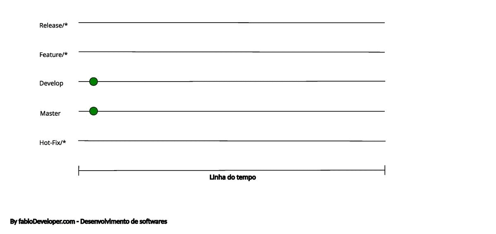

# Gitflow explained

## What is Gitflow?

Gitflow is a branching model for Git, created by Vincent Driessen. It has attracted a lot of attention because it is very well suited to collaboration and scaling the development team.

## How does it work?

- **Master Branch**: this is the main branch where the source code of HEAD always reflects a production-ready state.

- **Develop Branch**: this is the main branch where the source code of HEAD always reflects a state with the latest delivered development changes for the next release. Some would call this the “integration branch”. This is where any automatic nightly builds are built from.

- **Feature Branches**: this is where the bulk of development takes place. Each new feature should reside in its own branch, which can be pushed to the central repository for backup/collaboration. But, instead of branching off of master, feature branches use develop as their parent branch. When a feature is complete, it gets merged back into develop. Features should never interact directly with master.

- **Release Branches**: once develop has acquired enough features for a release (or a predetermined release date is approaching), you fork a release branch off of develop. Creating this branch starts the next release cycle, so no new features can be added after this point, only bug fixes, documentation generation, and other release-oriented tasks should go in this branch. Once it is ready to ship, the release gets merged into master. _In addition, it should be merged back into develop, which may have progressed since the release was initiated_.

- **Hotfix Branches**: are used to quickly patch production releases. This is the only branch that should fork directly off of master. As soon as the fix is complete, it should be merged into both master and develop (or the current release branch), and master should be tagged with an updated version number.

## Gitflow in action

---
By [fabioDeveloper.com](https://www.fabioDeveloper.com) & [CriarProgramas.com](https://www.criarprogramas.com) | 2023
